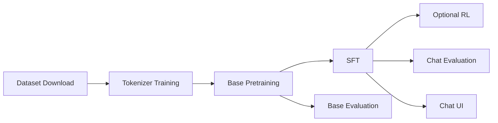

# nanochat — knowledge.md

## Overview

nanochat is a minimal, hackable experimental harness for training LLMs from scratch on a single GPU node. It is designed to cover the full LLM lifecycle with relatively little code: tokenizer training, base pretraining, supervised finetuning (SFT), reinforcement learning, evaluation, inference, tool use, and a ChatGPT-like web UI.

The repo’s headline claim is that a GPT-2-capability model can now be trained for roughly tens of dollars on modern hardware, instead of the far higher costs associated with 2019-era GPT-2 training. The current primary optimization target is the **“Time-to-GPT-2” speedrun**: the wall-clock time required to exceed GPT-2’s DCLM CORE score on an 8×H100 node.

## Core design philosophy

### 1. Minimalism

nanochat intentionally avoids heavy framework abstractions. The codebase favors simple scripts and direct Python over layered config systems.

### 2. One main complexity dial: `--depth`

The main way to scale models is by setting the transformer depth. Other important hyperparameters are derived automatically from this choice so that the repo can train a compute-optimal “miniseries” of models.

### 3. End-to-end usability

The repository is not just a model definition. It includes the entire stack needed to:

- download / read training data
- train a tokenizer
- pretrain a base model
- add chat behavior via SFT
- optionally run RL
- evaluate the model
- chat with it in a CLI or browser

## High-level training flow



## Core file structure

```text
.
├── dev
│   ├── gen_synthetic_data.py       # Example synthetic data for identity
│   ├── generate_logo.html
│   ├── nanochat.png
│   └── repackage_data_reference.py # Pretraining data shard generation
├── nanochat
│   ├── checkpoint_manager.py       # Save/Load model checkpoints
│   ├── common.py                   # Misc utilities
│   ├── core_eval.py                # DCLM CORE evaluation
│   ├── dataloader.py               # Tokenizing distributed data loader
│   ├── dataset.py                  # Dataset download/read utilities
│   ├── engine.py                   # Efficient inference with KV cache
│   ├── execution.py                # Python tool execution
│   ├── gpt.py                      # Transformer implementation
│   ├── loss_eval.py                # Bits-per-byte evaluation
│   ├── optim.py                    # Muon + AdamW optimizers
│   ├── report.py                   # Report generation helpers
│   ├── tokenizer.py                # BPE tokenizer wrapper
│   └── ui.html                     # Web frontend
├── runs
│   ├── miniseries.sh
│   ├── runcpu.sh
│   ├── scaling_laws.sh
│   └── speedrun.sh
├── scripts
│   ├── base_eval.py
│   ├── base_train.py
│   ├── chat_cli.py
│   ├── chat_eval.py
│   ├── chat_rl.py
│   ├── chat_sft.py
│   ├── chat_web.py
│   ├── tok_eval.py
│   └── tok_train.py
├── tasks
│   ├── arc.py
│   ├── common.py
│   ├── customjson.py
│   ├── gsm8k.py
│   ├── humaneval.py
│   ├── mmlu.py
│   ├── smoltalk.py
│   └── spellingbee.py
└── tests
    └── test_engine.py
```

## Core modules

### `nanochat/gpt.py`

Defines the main GPT transformer and its configuration.

Notable architectural features called out directly in the file:

- rotary embeddings instead of learned positional embeddings
- QK norm
- untied token embedding and LM head weights
- ReLU² activation in the MLP
- norm after token embedding
- RMSNorm without learnable parameters
- no bias in linear layers
- Group-Query Attention (GQA)
- Flash Attention 3 integration

Example configuration:

```python
@dataclass
class GPTConfig:
    sequence_len: int = 2048
    vocab_size: int = 32768
    n_layer: int = 12
    n_head: int = 6
    n_kv_head: int = 6
    n_embd: int = 768
    window_pattern: str = "SSSL"
```

`window_pattern` controls sliding-window attention behavior across layers. Characters mean:

- `L` = long / full-context attention
- `S` = short / quarter-context attention

The pattern is tiled across layers, with the final layer always long.

### `nanochat/engine.py`

Handles efficient autoregressive inference.

Important ideas:

- works directly on token id sequences
- maintains a KV cache for fast decoding
- supports multi-sample generation from one prefill pass
- contains a tool-use state machine for Python / calculator execution

The KV cache is designed for Flash Attention 3’s `flash_attn_with_kvcache` API, using `(B, T, H, D)` layout and in-place cache updates.

### `nanochat/optim.py`

Implements the hybrid optimizer strategy used in training.

- **Muon** is used for matrix parameters.
- **AdamW** is used for embeddings and non-matrix / scalar-like parameters.

The file notes several implementation choices:

- simplified parameter grouping and stacking
- a fused momentum → orthogonalization → variance-reduction → update kernel
- no strong assumptions about architecture-specific parameter layout

It also references:

- Newton–Schulz-style orthogonalization background
- Polar Express Sign Method
- NorMuon variance reduction

### `nanochat/tokenizer.py`

Wraps the BPE tokenizer and provides conversation rendering logic.

A central method is `render_conversation`, which converts a structured multi-turn chat into:

- `ids`: token ids
- `mask`: training mask indicating which tokens are supervised

It supports chat-format special tokens and tool-use tokens, including:

- `<|user_start|>` / `<|user_end|>`
- `<|assistant_start|>` / `<|assistant_end|>`
- `<|python_start|>` / `<|python_end|>`
- `<|output_start|>` / `<|output_end|>`

The implementation ensures that assistant textual outputs are supervised, while Python tool outputs injected at inference time are not.

### `nanochat/dataset.py`

Defines the default pretraining data source.

The dataset is hosted at:

```python
BASE_URL = "https://huggingface.co/datasets/karpathy/climbmix-400b-shuffle/resolve/main"
MAX_SHARD = 6542
```

This means the repo is set up to use **ClimbMix-400B shuffled parquet shards**, with filenames such as `shard_06542.parquet`.

## Dataset and tokenizer pipeline

### Pretraining data

nanochat currently uses the ClimbMix dataset for its main speedrun path. This is presented as an important improvement over earlier settings and is associated with a substantial speedup on the leaderboard.

### Tokenizer training

The reference speedrun trains a BPE tokenizer with vocabulary size `32768` (`2**15`) on roughly **2B characters** of data.

Reference command:

```bash
python -m scripts.tok_train
```

You can then evaluate tokenizer compression using:

```bash
python -m scripts.tok_eval
```

## Base pretraining

The main base-model training script is:

```bash
torchrun --standalone --nproc_per_node=8 -m scripts.base_train -- ...
```

### Reference speedrun command

```bash
torchrun --standalone --nproc_per_node=8 -m scripts.base_train -- \
    --depth=24 \
    --target-param-data-ratio=8 \
    --device-batch-size=16 \
    --fp8 \
    --run=$WANDB_RUN
```

Important interpretation:

- `depth=24` is the main model-size choice
- `target-param-data-ratio=8` is intentionally slightly below the default compute-optimal setting to beat GPT-2 faster in wall-clock time
- `device-batch-size=16` is the reference H100 setup
- `--fp8` enables FP8 training on supported Hopper-class GPUs

### Research-mode smaller run

For fast iteration, the README shows a smaller experiment such as:

```bash
OMP_NUM_THREADS=1 torchrun --standalone --nproc_per_node=8 -m scripts.base_train -- \
    --depth=12 \
    --run="d12" \
    --model-tag="d12" \
    --core-metric-every=999999 \
    --sample-every=-1 \
    --save-every=-1
```

This is useful for quick validation of code changes before running larger models.

## Evaluation

nanochat uses two major evaluation families.

### 1. Validation bits per byte (`val_bpb`)

This is a compression-style loss metric that is easier to compare across tokenizers than raw cross-entropy loss.

### 2. DCLM CORE score

This is the primary capability metric used for the “Time-to-GPT-2” leaderboard. The repo treats the key milestone as surpassing GPT-2’s CORE score:

```text
GPT-2 CORE = 0.256525
```

### Example evaluation commands

Evaluate a Hugging Face model:

```bash
torchrun --nproc_per_node=8 -m scripts.base_eval --hf-path openai-community/gpt2
```

Evaluate a nanochat checkpoint:

```bash
torchrun --nproc_per_node=8 -m scripts.base_eval --model-tag d24 --device-batch-size=16
```

Approximate / quick single-GPU eval:

```bash
python -m scripts.base_eval --model-tag d24 --device-batch-size=16 --max-per-task=100 --split-tokens=524288
```

## Chat SFT and conversation format

The main supervised chat finetuning script is:

```bash
torchrun --standalone --nproc_per_node=8 -m scripts.chat_sft -- --device-batch-size=16 --run=$WANDB_RUN
```

The repo supports structured conversation rendering and tool-use markup. Assistant content can be either:

- plain text
- a sequence of typed parts such as text, python, and python_output

This enables training chat models that can interleave natural language with Python tool calls.

### Synthetic identity data

The repo includes `dev/gen_synthetic_data.py` as an example generator for synthetic identity/capability data. The reference speedrun also downloads a synthetic identity conversation dataset before SFT. This is the canonical path for injecting custom assistant identity and behavior.

### Supported task sources

Examples under `tasks/` include:

- ARC
- GSM8K
- MMLU
- SmolTalk
- custom JSONL conversations
- simple coding tasks
- spelling/counting tasks

## Tool use during inference

nanochat supports a calculator-style Python execution loop.

High-level process:

1. the model emits `<|python_start|>`
2. the engine records tokens inside the Python block
3. the model emits `<|python_end|>`
4. the engine decodes the expression and executes it
5. the result is injected as `<|output_start|> result <|output_end|>`

The generation loop also tracks per-row completion and forced tokens, so tool outputs can be inserted deterministically rather than sampled.

## Precision and dtype strategy

nanochat explicitly avoids relying on `torch.amp.autocast`. Instead, it manages compute dtype directly.

A representative pattern used in the repo is:

```python
COMPUTE_DTYPE = (
    torch.bfloat16 if device.type == "cuda" and torch.cuda.get_device_capability()[0] >= 8
    else torch.float32
)
```

### Hardware behavior

- **CUDA SM80+** (A100, H100): `bfloat16`
- **Older CUDA GPUs**: `float32` by default
- **CPU / MPS**: `float32`
- **Hopper+**: optional FP8 training via `--fp8`

This explicit precision design is one of the repo’s major implementation choices.

## Reference workflow: `runs/speedrun.sh`

The most important operational script is:

```bash
bash runs/speedrun.sh
```

At a high level, this script performs:

1. environment / dependency setup
2. dataset download
3. tokenizer training
4. tokenizer evaluation
5. base pretraining
6. base evaluation
7. synthetic identity data download
8. chat SFT
9. chat evaluation
10. report / final artifacts

After training, you can launch the web chat UI with:

```bash
python -m scripts.chat_web
```

Or use the CLI:

```bash
python -m scripts.chat_cli
```

## Time-to-GPT-2 leaderboard context

The repo maintains a leaderboard for wall-clock time to exceed GPT-2’s CORE score on an 8×H100 node.

Representative entries described in the README include:

| Rank | Time (hours) | val_bpb | CORE   | Description                        |
| ---- | ------------ | ------- | ------ | ---------------------------------- |
| 0    | 168.00       | -       | 0.2565 | Original OpenAI GPT-2 (2019)       |
| 1    | 3.04         | 0.74833 | 0.2585 | d24 baseline, slightly overtrained |
| 2    | 2.91         | 0.74504 | 0.2578 | d26 slightly undertrained + fp8    |
| 3    | 2.76         | 0.74645 | 0.2602 | bump total batch size to 1M tokens |
| 4    | 2.02         | 0.71854 | 0.2571 | change dataset to NVIDIA ClimbMix  |
| 5    | 1.80         | 0.71808 | 0.2690 | autoresearch round 1               |
| 5    | 1.65         | 0.71800 | 0.2626 | autoresearch round 2               |

This leaderboard reflects the repo’s main optimization agenda more than any single benchmark score in isolation.

## Dependencies and packaging

The project uses `uv` and `pyproject.toml` for dependency management.

Typical setup:

```bash
uv venv
source .venv/bin/activate
uv pip install -e .
```

The repo also supports CPU/GPU-specific dependency selection in its packaging setup. In practice, users often install the project in editable mode and then run the reference scripts directly.

## Practical mental model

nanochat can be thought of as four layers:

1. **Data & tokenizer layer**
   - dataset download
   - BPE tokenizer training and evaluation

2. **Base model layer**
   - GPT architecture
   - Muon/AdamW training
   - CORE and BPB evaluation

3. **Chat alignment layer**
   - conversation rendering
   - SFT
   - RL
   - task mixtures
   - identity/capability injection

4. **Inference & UX layer**
   - efficient KV-cache decoding
   - tool use
   - CLI chat
   - web chat UI

## Good reading order for the repo

A practical order for understanding the repository is:

1. `README.md`
2. `runs/speedrun.sh`
3. `nanochat/gpt.py`
4. `nanochat/engine.py`
5. `nanochat/tokenizer.py`
6. `nanochat/optim.py`
7. `scripts/base_train.py`
8. `scripts/chat_sft.py`
9. `scripts/base_eval.py`
10. `scripts/chat_web.py`

## One-paragraph summary

nanochat is a compact, end-to-end LLM training and serving repo centered on one major scaling knob, `--depth`. It includes a modern GPT implementation with GQA, rotary embeddings, sliding-window attention, Flash Attention 3 support, a hybrid Muon/AdamW optimizer, BPE tokenizer training, chat conversation rendering with tool-use tokens, evaluation via BPB and DCLM CORE, and an inference engine with KV cache plus Python calculator execution. Its current flagship objective is reducing wall-clock “time to GPT-2” on an 8×H100 node, and `runs/speedrun.sh` is the canonical path from raw data to a chat-capable model.